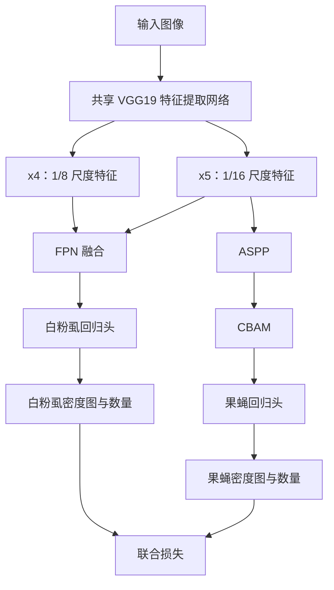

### models.msdm

```mermaid
flowchart TB
    A["输入图像"]
    B["共享 VGG19 特征提取网络"]

    A --> B

    B --> C["x4：1/8 尺度特征"]
    B --> D["x5：1/16 尺度特征"]

    C --> E["FPN 融合"]
    D --> E
    E --> F["白粉虱回归头"]
    F --> G["白粉虱密度图与数量"]

    D --> H["ASPP"]
    H --> I["CBAM"]
    I --> J["果蝇回归头"]
    J --> K["果蝇密度图与数量"]

    G --> L["联合损失"]
    K --> L
```
